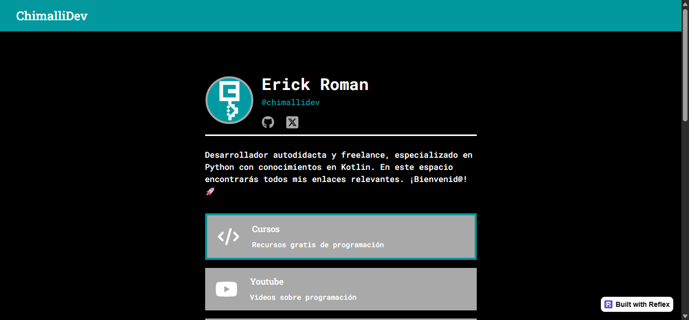

# &nbsp;Página de enlaces de Chimallidev

## Descripción
Aplicación web construida con Python y Reflex que funciona como centro de enlaces personales y profesionales de Chimallidev. Permite acceder fácilmente a proyectos, plataformas de contacto y contenido relacionado con programación.

## Autor 💻
**Erick Roman**

* [LinkedIn](https://www.linkedin.com/in/chimallidev)
* [Portafolio](https://portafolio-chimallidev.onrender.com/)

## DEMO, Ver ejemplo en vivo

[DEMO](https://chimallidev-links-web.vercel.app/)

## Tecnologías utilizadas

 
  
  
  
  
 

## Documentación 📑

## Contratación

Si quieres contratarme puedes escribirme a chimalli.dev@gmail.com para consultas.

## 🚀 Impulsa nuevos proyectos y contenido

🌌 Si te gusta esta proyecto, puedes darle una ⭐ y compartirlo con amigos.

